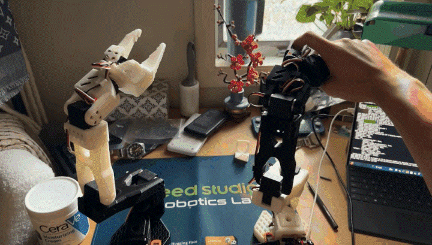

# SO-101 Robotic Arm

## Demo

A leader-follower robotic manipulation platform built using the open-source SO-101 architecture and Hugging Face LeRobot framework. The project covers mechanical assembly, serial bus servo configuration, arm calibration, real-time teleoperation, and learning-based robotic manipulation.

## Overview

This is a personal robotics project focused on developing hands-on experience across the robotics stack — from mechanical assembly and hardware integration to robot control, computer vision, data collection, and imitation learning.

The system consists of a manually controlled leader arm and a six-axis follower arm. Leader joint positions are communicated to the follower through LeRobot for real-time teleoperation. Future development will use teleoperated demonstrations to train autonomous manipulation policies.

## Hardware

- SO-101 leader and follower robotic arms
- Feetech STS3215 serial bus servo motors
- 3D-printed PLA structural components
- Serial bus servo controller boards
- 5V leader and 12V follower power systems
- USB serial communication

## Software Stack

- Python 3.10
- Hugging Face LeRobot
- PyTorch
- Miniforge / Conda
- Ubuntu 22.04 via WSL2

## Project Phases

### Phase 1 — Mechanical Assembly
- [x] Source and 3D print structural components
- [x] Assemble leader and follower manipulators
- [x] Install motors, servo horns, cabling, and controller hardware

### Phase 2 — Motor Configuration and Calibration
- [x] Assign unique IDs to 12 Feetech serial bus servos
- [x] Configure motor communication parameters
- [x] Calibrate six joints on the leader and follower arms through their full ranges of motion

### Phase 3 — Teleoperation
- [x] Configure LeRobot development environment
- [x] Establish USB serial communication through Ubuntu and WSL2
- [x] Implement real-time leader-follower teleoperation
- [ ] Develop custom Python scripts for programmatic joint control

### Phase 4 — Vision and Data Collection
- [ ] Integrate cameras into the manipulation workspace
- [ ] Configure OpenCV camera streams
- [ ] Record teleoperated manipulation demonstrations
- [ ] Build and visualize LeRobot datasets

### Phase 5 — Imitation Learning
- [ ] Train an ACT policy using recorded demonstrations
- [ ] Evaluate autonomous task execution
- [ ] Analyze task success rate and failure modes
- [ ] Improve policy performance through dataset iteration

## Current Status

Leader and follower arms have been assembled, configured, and calibrated. Real-time teleoperation is functional, with the follower arm replicating joint motion from the leader arm.

The next development milestone is camera integration and collection of the first teleoperated manipulation dataset.

## Build Log

- **June 2026** — Repository initialized and structural components printed at Syracuse University.
- **July 2026** — Configured motor IDs and communication parameters for 12 serial bus servos.
- **July 2026** — Completed mechanical assembly and full-range calibration of leader and follower arms.
- **July 2026** — Established real-time leader-follower teleoperation using LeRobot.

## References

- [SO-101 Documentation](https://huggingface.co/docs/lerobot/en/so101)
- [SO-ARM100 Hardware Repository](https://github.com/TheRobotStudio/SO-ARM100)
- [LeRobot Framework](https://github.com/huggingface/lerobot)
